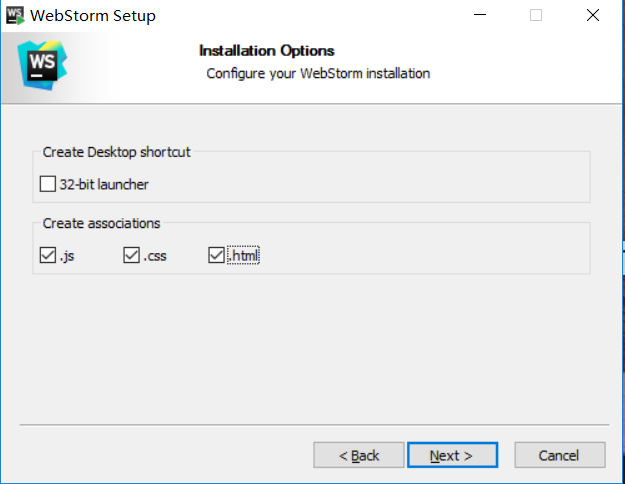
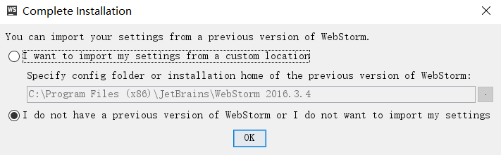
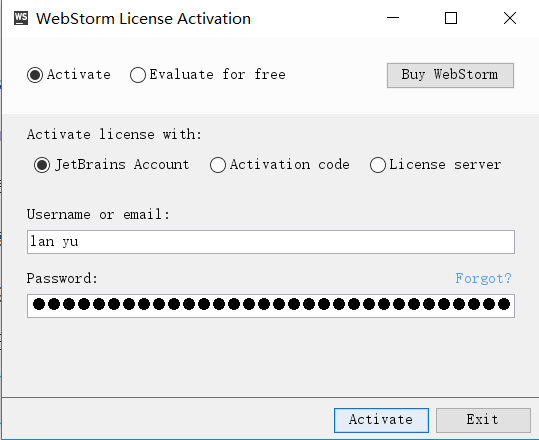
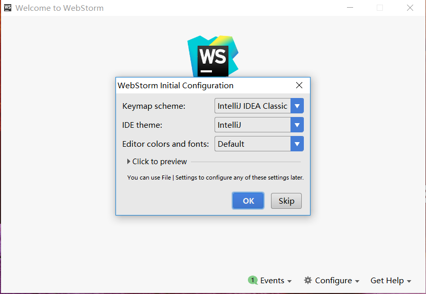
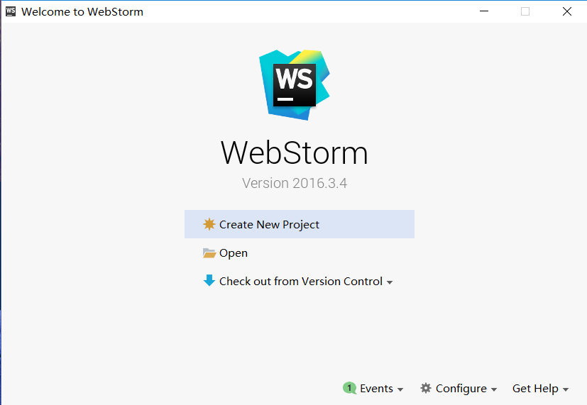
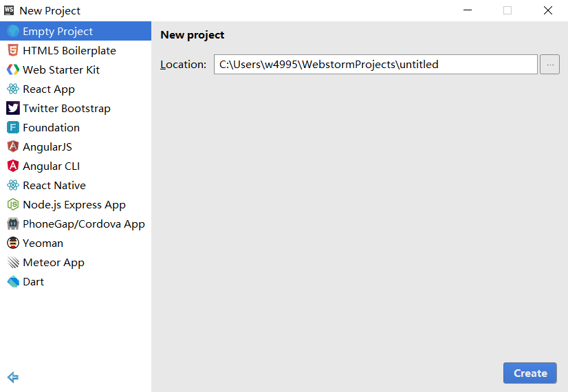
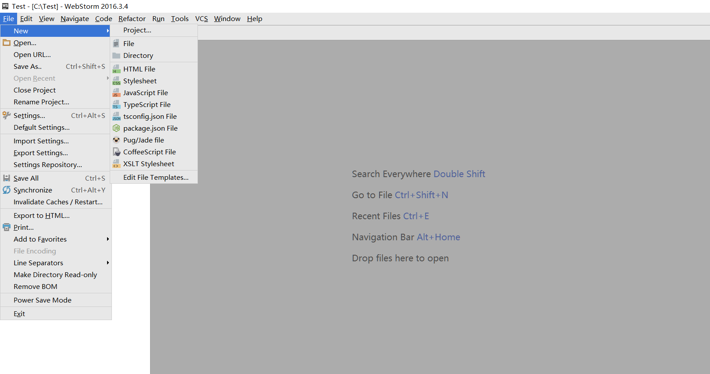

# Web Storm使用笔记	

## 1.下载

* 下载地址：http://www.jetbrains.com/webstorm/download/#section=windows

## 2.安装

* 1.和平常其他程序的安装过程是一样的，安装过程中出现如下图内容，可选可不选`英文的意思是是否建立关联`

* 2.首次运行会弹出如下图的窗口，下面是英文的意思翻译:`你可以从以前的WebStorm版本中导入设置`

   `1:我想从自定义位置导入设置，指定WebStorm以前版本的配置文件夹或安装目录`

   `2:我没有WebStorm以前的版本，或者我不想输入我的设置`
 

* 3.安装完成

## 3.激活

* 1.安装完成之后会出现如下图弹窗（已经安装试用的，点击`help -->Register`也会弹出下图弹窗）

* 2.在网站：http://idea.lanyus.com/ 中获取注册码，然后选择`License server`选项输入注册码，激活完毕

## 4.配置

* 1.激活之后打开软件，弹出如下图窗口，让用户选择不同风格的编辑界面(比如黑色背景或者蓝色背景，不同颜色的标签等等)点击OK进入主界面

* 2.设置完成之后会弹出如下图弹窗，新用户点击Create New Project即可

## 5.基本使用方法

* 1.第一次使用软件会出现如下图弹窗，根据需求选择版本和路径，无特殊需求选择默认Empty Project即可，路径自己选择，确认后点击右下角create即可

* 2.点击左上角File -->New 1可新建各种文件如下图：

* 3.各种常用快捷键：
|ctrl+D                |     复制当前行|
|:-----------|
|ctrl+键盘左右键         |     以单词为边界跳光标位置|
|ctrl+alt+L            |     格式化代码|
|shift+tab/tab         |     减少/扩大缩进(可以在代码中减少行缩进)|
|ctrl+Y                |     删除一行|
|shift+enter           |     重新开始一行(无论光标在哪个位置)|
|ctrl+/                |     行注释(已注释的可解除注释)|
|ctrl+shift+/          |     块注释(已注释的可解除注释)|
|F5                    |     文件另存为|
|tab                   |     快速输入标签(比如像快速输入&lt;div&gt;&lt;/div&gt;只要输入div然后按tab键就可以)|

## 6.markdown的基本使用方法

* 1.插件安装：点击左上角File-->Settings-->Plugins-->Browse repositories,在此菜单中找到Markdown support，点击Install安装
* 2.Markdown基本语法参考网站：https://www.zybuluo.com/mdeditor?url=https://www.zybuluo.com/static/editor/md-help.markdown
